# *[Netlify : Module 2](https://jhonson-revou-m1.netlify.app/)*
# *[Domain jhonson.tech](https://jhonson.tech/)*

1. buka web netlify dan login dengan github
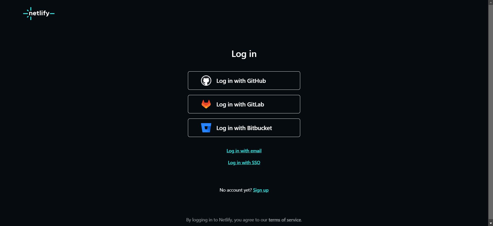
2. setelah berhasil klik add new site, dan klik deploy with github
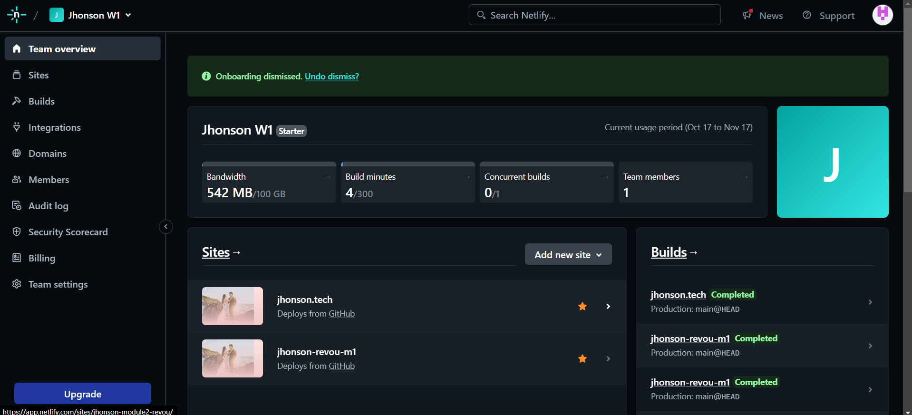
3. kemudian pilih repository (revou-fsse-3)
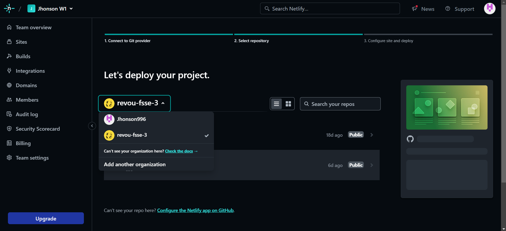
4. select repository yang di inginkan
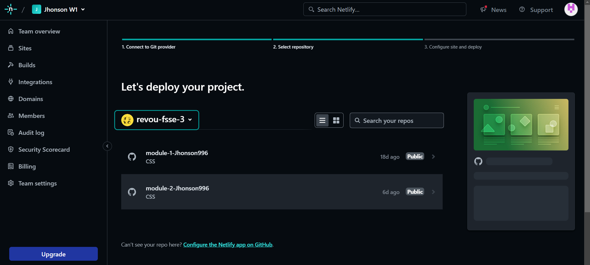
5. dan kemudian klik deploy
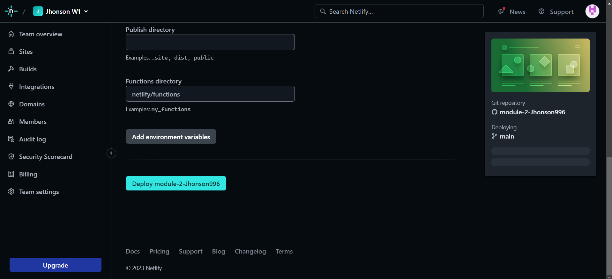
6. kemudian klik set custom Domain
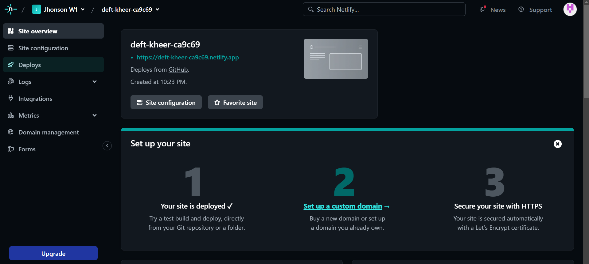
7. Masukin domain yang sudah ada dan klik verify
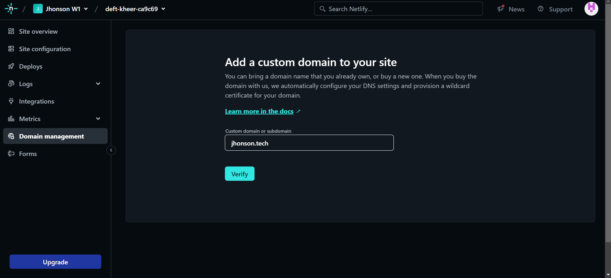
8. buka / klik domain management
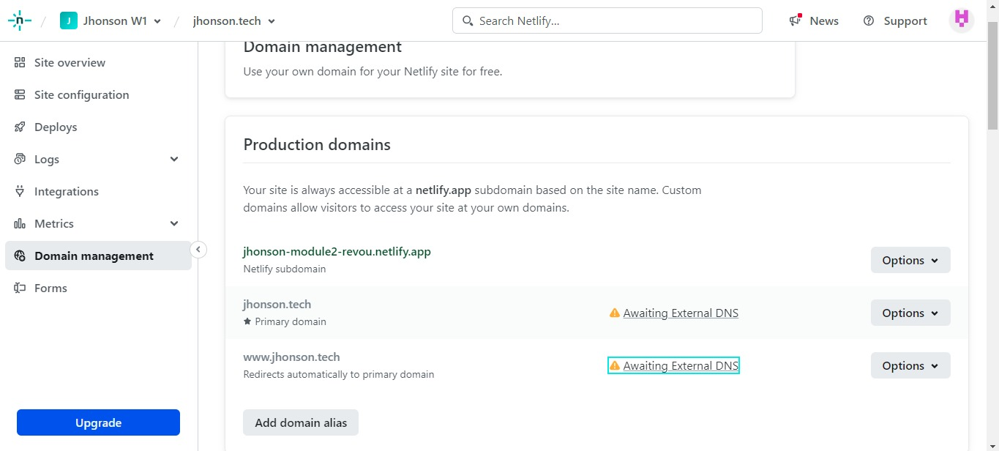
9. selanjutnya klik Awaiting External DNS dan akan memuncul kan dns configuration, dan copy yang sudah di blok
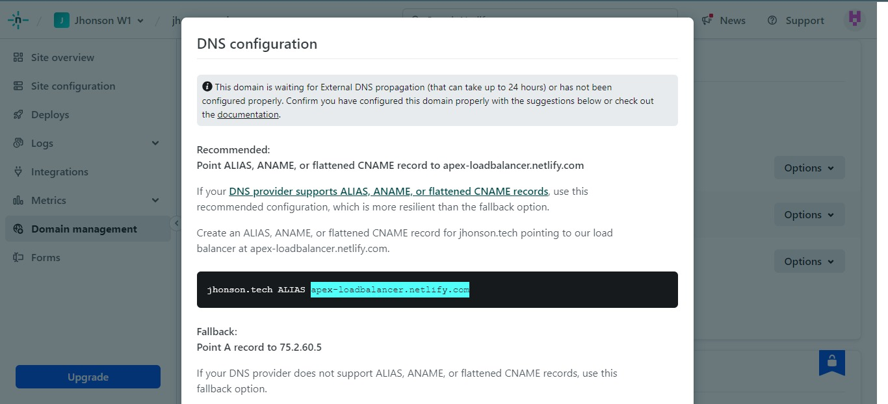
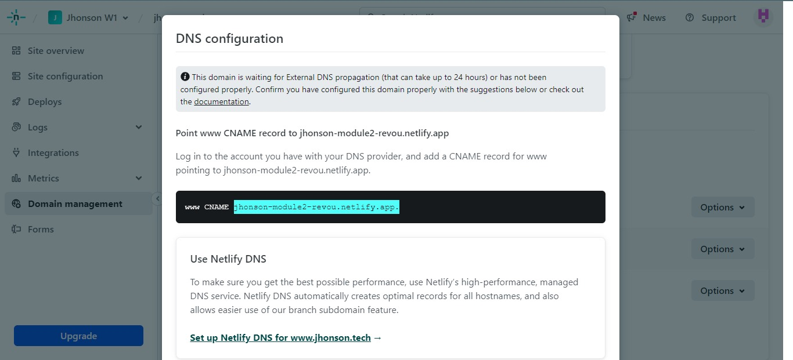
10. selanjutnya masukkan ke bagian Manage DNS Record
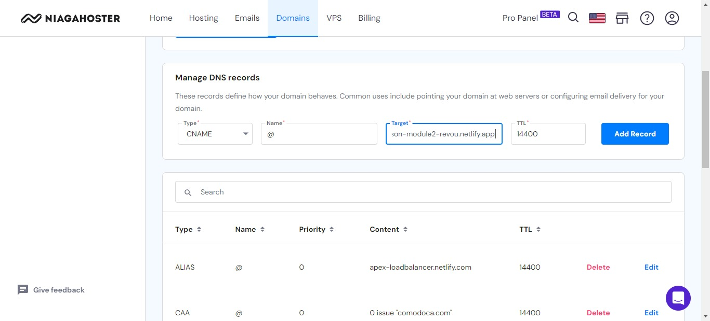
11. dan hasil akhir seperti gambar dibawah ini
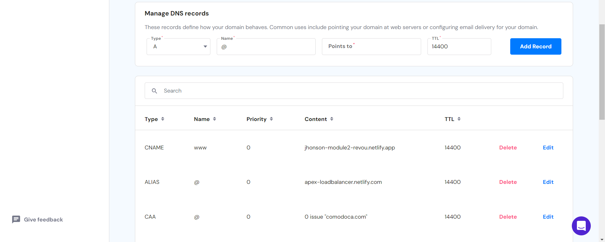
12. Tinggal tunggu hingga *[Domain jhonson.tech](https://jhonson.tech/)* dapat dipakai